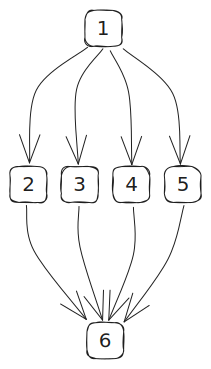

# Complexidade Ciclomática

[Estudo de Caso](https://facens.instructure.com/courses/11854/files/2725633?module_item_id=426090)

1. Análise do código
2. Enumerar o código
3. Grafo

    |Grafo|Legenda|
    |-|-|
    ||    - [1]: Coleta da idade do funcionário  - [2]: Caso tenha menos de 16 anos de idade  - [3]: Caso tenha entre 16 e 18 anos de idade  - [4]: Caso tenha entre 19 e 55 anos de idade  - [5]: Caso tenha mais de 55 anos de idade  - [6]: Fim do Programa|

4. Determinar Caminhos Básicos

    - 1. 1 - 2 - 6
    - 2. 1 - 3 - 6
    - 3. 1 - 4 - 6
    - 4. 1 - 5 - 6

5. Descrever Caminhos
6. Determinar Qt de Caminhos
7. Determinar Qt de casos de testes
8. Determinar métrica de complexidade
9. Criar casos de testes
    - Cobertura 100%
    - Técnica de particionamento por equivalência
    - Técnica de particionamento por Valor Limite
10. Verificar Resultados no JaCoCo (Relatório)

## Checklist

- [x] Análise do código
- [x] Enumerar o código
- [x] Grafo
- [x] Determinar Caminhos Básicos
  - [x] Descrever Caminhos
  - [x] Determinar Qt de Caminhos
- [ ] Determinar Qt de casos de testes
- [ ] Determinar métrica de complexidade
- [ ] Criar casos de testes
- [ ] Verificar Resultados no JaCoCo (Relatório)

## Referencias
